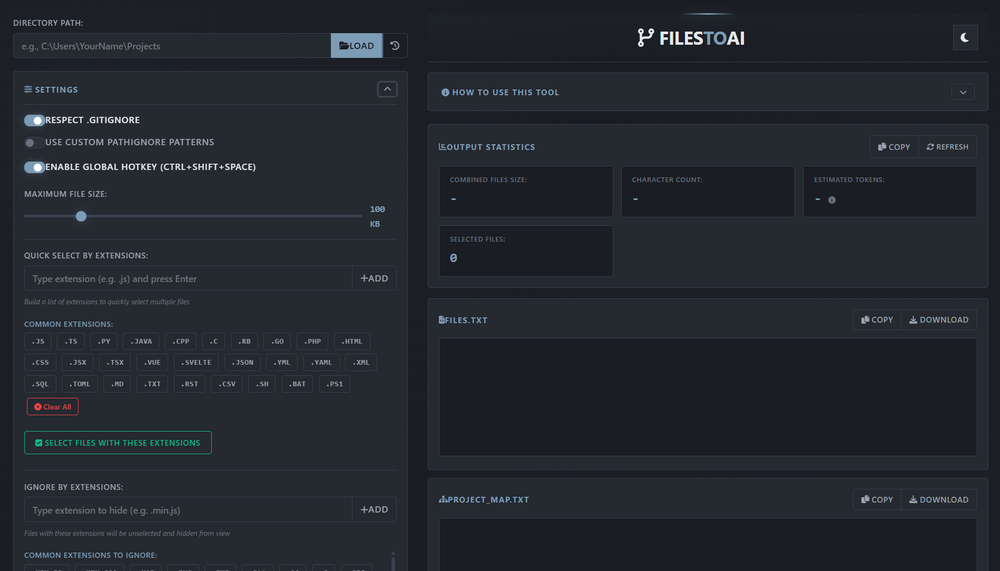

# FilesToAI

**Instantly export your codebase to AI. Smart filtering, one-click copy, global hotkey.**



---

## 🚀 Quick Start

```bash
git clone https://github.com/yourusername/FilesToAI
cd FilesToAI
pip install -r requirements.txt
python app.py
```

**→** Open `http://127.0.0.1:5023`

---

## 💡 What It Does

Select files from your project → Generate AI-ready output → Copy with `Ctrl+Shift+Space`

Perfect for feeding context to ChatGPT, Claude, and other LLMs.

---

## ✨ Features

### Smart Selection
- ✓ `.gitignore` + custom patterns (with live testing)
- ✓ Quick-select by extension
- ✓ Hide unwanted files (images, logs, minified)
- ✓ File size limits + real-time stats

### Outputs
- **files.txt** — File contents concatenated
- **project_map.txt** — Directory structure
- **Combined export** — Everything in one click

### Power Tools
- 🔥 **Global Hotkey** — `Ctrl+Shift+Space` copies from anywhere
- 🌓 **Dark/Light Mode** — Automatically themed
- 📜 **Path History** — Recent projects saved
- 💾 **Persistent Config** — Settings survive restarts

---

## 📖 How To Use

| Step | Action |
|------|--------|
| **1** | Enter project path → Click **Load** |
| **2** | Configure filters & ignore patterns |
| **3** | Check files/folders in tree view |
| **4** | Click **Generate Output** or press `Ctrl+Shift+Space` |
| **5** | Copy or download results |

**Pro Tip:** Keep the app running in the background and use `Ctrl+Shift+Space` to instantly copy your last selection from any window.

---

## 🔧 Advanced

<details>
<summary><b>Custom Ignore Patterns</b></summary>

Use `.gitignore` syntax for fine control:
```
node_modules/
*.log
__pycache__/
dist/**/*.map
```
Test patterns in-app before applying.
</details>

<details>
<summary><b>API Endpoints</b></summary>

RESTful API for automation:
- `GET /api/browse` — Directory structure
- `POST /api/select` — File selection
- `POST /api/generate` — Generate output
- `POST /api/global_trigger_generate_and_copy` — Hotkey endpoint

See `app.py` for full docs.
</details>

<details>
<summary><b>Global Hotkey Details</b></summary>

Press anywhere with app running:
1. Reads `filestoai_config.json`
2. Generates output from last selected files
3. Falls back to all files if none selected
4. Copies to clipboard instantly
</details>

---

## 🛠️ Tech Stack

`Flask` • `Bootstrap` • `jQuery` • `Python 3.8+`

---

## 📦 Dependencies

```
Flask>=2.3.0
keyboard>=0.13.5
pyperclip>=1.8.2
requests>=2.31.0
```

---

## 📄 License

MIT License

---

## 🤝 Contributing

PRs welcome! Open an issue for major changes.

---

<div align="center">

**Made for developers who ship with AI** ⚡

[⭐ Star this repo](https://github.com/mystxcal/FilesToAI) • [🐛 Report Bug](https://github.com/mystxcal/FilesToAI/issues) • [💡 Request Feature](https://github.com/mystxcal/FilesToAI/issues)

</div>
